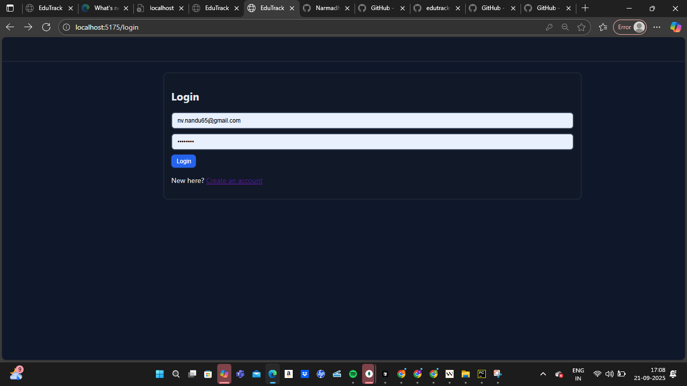
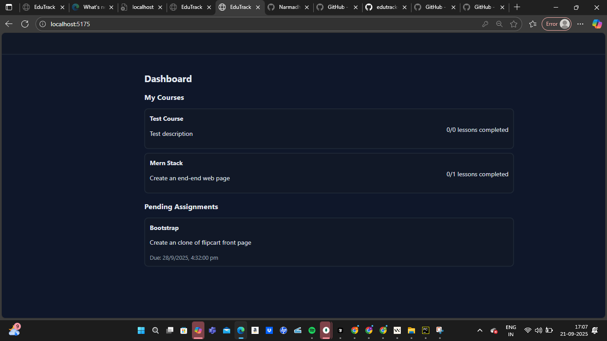
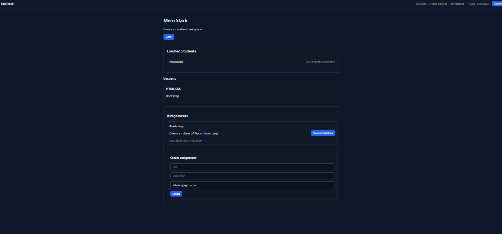

# EduTrack (MERN)

- Authentication (register/login with JWT)
- Course catalog with search
- Instructor course creation
- Enrollments and simple lesson progress tracking

## Tech Stack

- Backend: Node.js, Express, MongoDB (Mongoose), JWT, bcrypt
- Frontend: React (Vite), React Router, Axios

## Screenshots

### Login


### Student Dashboard


### Teacher Dashboard

 

## Project Structure

```
Edutrack2/
  server/
    src/
      index.js
      models/{User.js, Course.js, Enrollment.js}
      routes/{auth.js, courses.js, enrollments.js}
      middleware/auth.js
    package.json
    .env.example
  client/
    src/
      pages/{Login.jsx, Register.jsx, Dashboard.jsx, Courses.jsx, CourseDetail.jsx}
      services/api.js
      styles.css
      App.jsx
      main.jsx
    index.html
    vite.config.js
    package.json
    .env.example
```

## Getting Started

Prereqs:
- Node.js 18+
- MongoDB running locally (or Atlas connection string)

1. Backend setup

```
cd server
cp .env.example .env  # on Windows create .env with same content
npm install
npm run dev
```

2. Frontend setup (in another terminal)

```
cd client
cp .env.example .env
npm install
npm run dev
```

- Frontend runs on http://localhost:5173
- API runs on http://localhost:5000

## Seeding a Course Quickly

After registering a user, you can create an instructor by updating the role in DB or modify register payload to `{ role: 'instructor' }` temporarily.

Create a course via HTTP:
```
POST http://localhost:5000/api/courses
Authorization: Bearer <your token>
Body:
{
  "title": "JavaScript Basics",
  "description": "Learn JS fundamentals",
  "tags": ["javascript", "beginner"],
  "lessons": [
    { "title": "Intro", "content": "What is JS?" },
    { "title": "Variables", "content": "let/const" }
  ]
}
```


